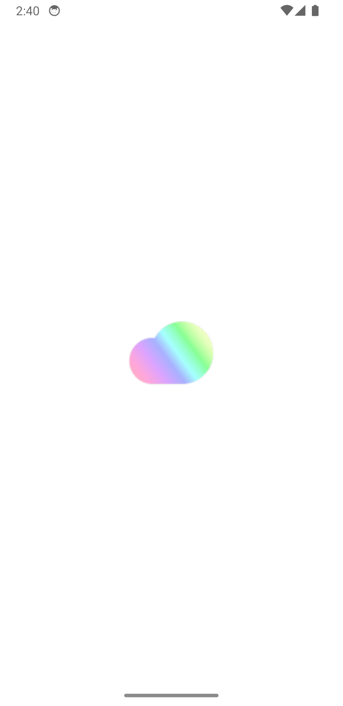
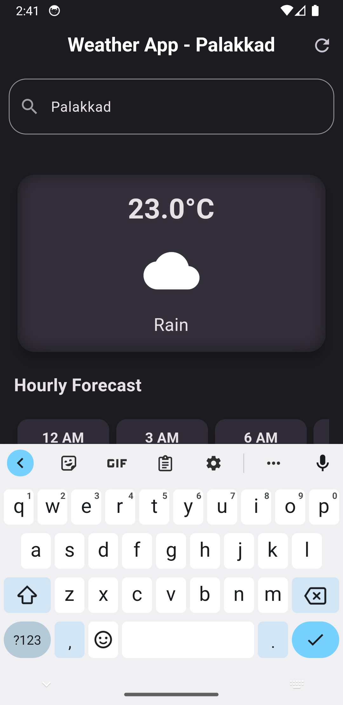
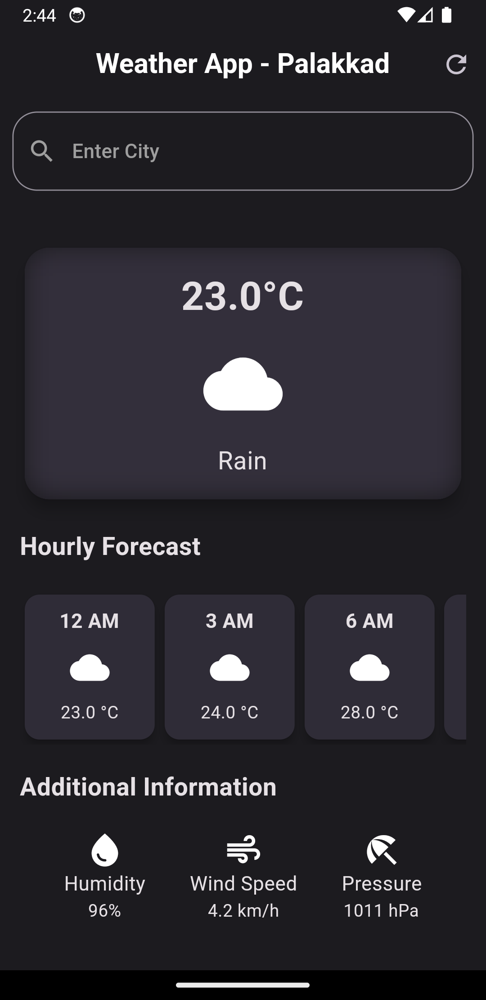

# WeatherAppX - A Simple Flutter Weather App


WeatherAppX is a straightforward and easy-to-use weather app built with Flutter, designed to provide you with quick access to weather information for different locations. Please note that this project might not receive regular updates.

## Screenshots






## Features

- **Current Weather:** Get real-time weather updates for your current location or any other location you search for.

- **Weather Forecast:** View the weather forecast for the next few days, including temperature, humidity, wind speed, and more.

- **Multiple Locations:** Add and track the weather for multiple locations of your choice.

- **User-Friendly Interface:** The app is designed to be intuitive and easy to navigate, making it suitable for users of all ages.

## Getting Started

To run WeatherAppX on your device, follow these steps:

1. Ensure you have Flutter installed on your machine. If not, you can download and set it up from the official [Flutter website](https://flutter.dev).

2. Clone this repository to your local machine using the following command:

   ```
   git clone https://github.com/anima-regem/weather_app.git
   ```

3. Navigate to the project directory:

   ```
   cd weather_app
   ```

4. Install the required dependencies:

   ```
   flutter pub get
   ```

5. Connect your device/emulator, and run the app:

   ```
   flutter run
   ```

## Contributing

Thank you for considering contributing to WeatherAppX! While this project may not be actively maintained, contributions are still welcome. Feel free to fork the repository and submit pull requests for any enhancements or bug fixes.

If you find any issues or have suggestions, you can create a new issue in the [Issues](https://github.com/anima-regem/weather_app/issues) section.

## License

WeatherAppX is open-source software licensed under the [MIT License](LICENSE).

## Contact

If you have any questions or inquiries, you can reach me at [vichukartha@gmail.com](mailto:vichukartha@gmail.com).

---
Please note that the information provided in this README is just an example, and you should customize it to fit your actual WeatherAppX project. Make sure to update the GitHub repository links, license information, and contact details as necessary. Additionally, include any specific setup or usage instructions relevant to your app.